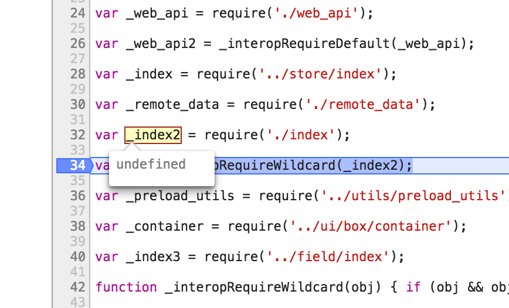

## How to reproduce issue

```shell
yarn
yarn run dev:js:once
open index.html
```

Output in console:

    Uncaught TypeError: l.setup is not a function
      at setupLock (actions.js:47)
      at Auth0Lock.Base (core.js:77)
      at new Auth0Lock (index.js:49)
      at makeAuth0Driver (makeAuth0Driver.js:149)
      at index.js:3
      at index.js:3

I can trace this to `node_modules/auth0-lock/lib/core/actions.js:32`. It seems that `require('./index')` is not resolved properly. I verified that the file is there.




## Dev server

If you want to play around you might find the dev server handy: `yarn run dev`

